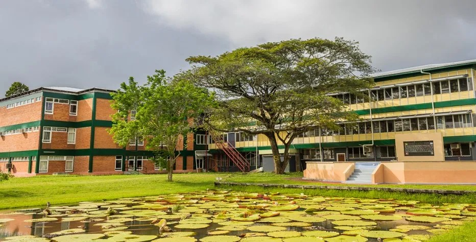

---
#
# By default, content added below the "---" mark will appear in the home page
# between the top bar and the list of recent posts.
# To change the home page layout, edit the _layouts/home.html file.
# See: https://jekyllrb.com/docs/themes/#overriding-theme-defaults
#
layout: home
---    

## **Mission Statement**

  

*The University of Guyana Library will strive to support the teaching and research activities of the University. It will provide the necessary human resources*
  
  

*and Information and Communications Technology (ICT) to meet the requirements of the electronic age, and serve as the beacon of academic research,*  

*both locally and internationally*.

   

## **Message from Mrs Gwyneth George, University Librarian**

  

*The Library remains committed to serving you, our users, to the improvement of our services and to the improvement of the access and delivery of information*.    
  

*Through this website, we aim to provide you with an array of information that keeps you in touch with information sources, regardless of the medium *

*in which it is packaged*.
  

*We trust that you will find the information on this site interesting. We welcome any comments and suggestions that would contribute to enhancing this website*.
  

 